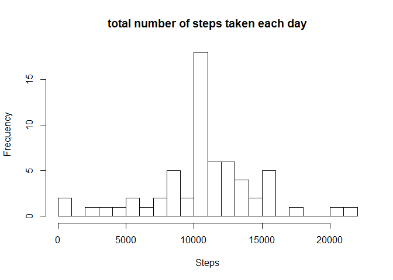

## Used libraries

```r
library(dplyr)
```

```
## 
## Attaching package: 'dplyr'
```

```
## The following objects are masked from 'package:stats':
## 
##     filter, lag
```

```
## The following objects are masked from 'package:base':
## 
##     intersect, setdiff, setequal, union
```

```r
library(ggplot2)
```

## Loading and preprocessing the data
### Load the data (i.e. read.csv())


```r
data <- read.csv("activity.csv", sep = ",", header = TRUE, na.strings = "NA")
```
### Process/transform the data (if necessary) into a format suitable for your analysis

```r
dataclean <- data[complete.cases(data),]
```
## What is mean total number of steps taken per day?
### Make a histogram of the total number of steps taken each day

```r
dataclean.date <- group_by(dataclean, date)
dataclean.date <- summarize(dataclean.date, steps=sum(steps))
      
hist(dataclean.date$steps, xlab = "Steps", breaks = 30, 
     main="total number of steps taken each day")
```

<!-- -->

### Calculate and report the mean and median total number of steps taken per day

```r
mean(dataclean.date$steps)
```

```
## [1] 10766.19
```

```r
median(dataclean.date$steps)
```

```
## [1] 10765
```

## What is the average daily activity pattern?
### Make a time series plot (i.e. type = "l") of the 5-minute interval (x-axis) and the average number of steps taken, averaged across all days (y-axis)

```r
dataclean.interval <- group_by(dataclean, interval)
dataclean.interval <- summarize(dataclean.interval, steps=mean(steps))
      
ggplot(dataclean.interval, aes(interval, steps)) + geom_line()
```

<!-- -->

### Which 5-minute interval, on average across all the days in the dataset, contains the maximum number of steps?

```r
dataclean.interval[dataclean.interval$steps==max(dataclean.interval$steps),]
```

```
## # A tibble: 1 x 2
##   interval steps
##      <int> <dbl>
## 1      835  206.
```
## Imputing missing values
### Calculate and report the total number of missing values in the dataset

```r
nrow(data) - nrow(dataclean)
```

```
## [1] 2304
```
### Devise a strategy for filling in all of the missing values in the dataset.
Solved automaticly into a new dataset, seet next code chunk

### Create a new dataset that is equal to the original dataset but with the missing data filled in.

```r
replacer <- function(x) replace(x, is.na(x), mean(x, na.rm = TRUE))
datamean <- data%>% group_by(interval) %>% mutate(steps= replacer(steps))
```
### Make a histogram of the total number of steps taken each day

```r
datamean.date <- group_by(datamean, date)
datamean.date <- summarize(datamean.date, steps=sum(steps))
      
hist(datamean.date$steps, xlab = "Steps", breaks = 30, 
           main="total number of steps taken each day")
```

<!-- -->

### Do these values differ from the estimates from the first part of the assignment?

```r
summary(dataclean)
```

```
##      steps                date          interval     
##  Min.   :  0.00   2012-10-02:  288   Min.   :   0.0  
##  1st Qu.:  0.00   2012-10-03:  288   1st Qu.: 588.8  
##  Median :  0.00   2012-10-04:  288   Median :1177.5  
##  Mean   : 37.38   2012-10-05:  288   Mean   :1177.5  
##  3rd Qu.: 12.00   2012-10-06:  288   3rd Qu.:1766.2  
##  Max.   :806.00   2012-10-07:  288   Max.   :2355.0  
##                   (Other)   :13536
```

```r
summary(datamean)
```

```
##      steps                date          interval     
##  Min.   :  0.00   2012-10-01:  288   Min.   :   0.0  
##  1st Qu.:  0.00   2012-10-02:  288   1st Qu.: 588.8  
##  Median :  0.00   2012-10-03:  288   Median :1177.5  
##  Mean   : 37.38   2012-10-04:  288   Mean   :1177.5  
##  3rd Qu.: 27.00   2012-10-05:  288   3rd Qu.:1766.2  
##  Max.   :806.00   2012-10-06:  288   Max.   :2355.0  
##                   (Other)   :15840
```
As you can see not one value changed.
## Are there differences in activity patterns between weekdays and weekends?
### Create a new factor variable in the dataset with two levels – “weekday” and “weekend”

```r
datamean$date <- as.Date(datamean$date)
datamean$weekday <- weekdays(datamean$date)
      
datamean$weekend <- ifelse(datamean$weekday=="Saturday" | 
                                    datamean$weekday=="Sunday", 
                                 "Weekend", "Weekday" )
      
datamean$weekend <- as.factor(datamean$weekend)
```
### Make a panel plot containing a time series plot

```r
ggplot(datamean, aes(interval, steps)) + geom_line() + facet_grid(weekend ~ .)
```

<!-- -->
